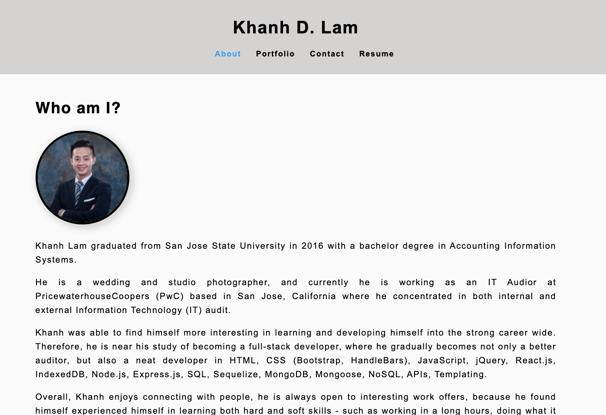

# Khanh D. Lam Portfolio 
Built with React

## Description
Being a web developer means being part of a community. I'll need a place to share my projects not only if I am applying for jobs or working as a freelancer but also so that I can share my work with fellow developers and collaborate on future projects.

Now that I've completed multiple projects, I am creating a portfolio, using my new React skills to help set my apart from other developers whose portfolios don’t use the latest technologies.

Just as I did many practice projects, I deployed this application to GitHub Pages.

Github Deployed Application Screenshot

## Table of Contents

* [Installation](#installation)
* [Usage](#usage)
* [License](#license)
* [Contributing](#contributing)
* [Tests](#tests)
* [Questions](#questions)
* [Links](#links)

## Installation

To use this application, please follow the following steps:
- Clone the repository using SSH - <git@github.com:khanhlam90/khanhlam_react_portfolio.git>
- npm init to install the listed dependencies.

## Usage 
After the installation, in the command-line, at the root directory, type npm start 

## License

This project is using the MIT License.

## Contributing

Please feel free to contribute to this project - please find my info at the [Questions](#questions) section and contact me for more infomation.

## Tests

Please refer to [Usage](#usage) section.

## Questions

Please reach me using:

<a href = "mailto:khanhlam1990@yahoo.com"> My Email </a>

[My Github Account](https://github.com/khanhlam90)

## Project Links:
* [Github deployed application](https://khanhlam90.github.io/khanhlam_react_portfolio/)
* [Github Repository](https://github.com/khanhlam90/khanhlam_react_portfolio.git)
